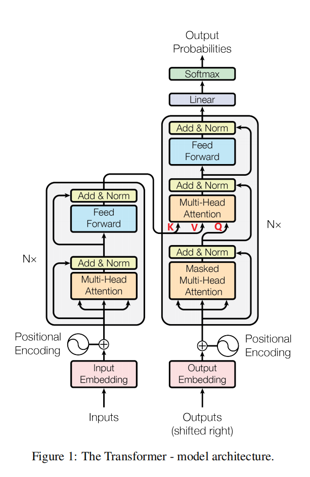

从上图中模型结构图可以知道Transformer有两个部分组成：EncoderLayer (x N) 和 DecoderLayer (x N)

```
      Transformer
            |---EncoderLayer (x N)
            |        |---MultiHeadAttention
            |        |---PositionwiseFeedForward
            |        |---SublayerConnection (Add&Norm)
            |
            |---DecoderLayer (x N)
                     |---MaskedMultiHeadAttention (添加了mask防止在生成的过程中看到后续字符)
                     |---MultiHeadAttention
                     |---PositionwiseFeedForward
                     |---SublayerConnection (Add&Norm)
```
其实Transformer的基础模块就三个，分别为MultiHeadAttention, PositionwiseFeedForward, SublayerConnection(Add&Norm)，其中，MaskedMultiHeadAttention 仅仅与MultiHeadAttention的Mask不同而已。<br>
我们先介绍EncoderLayer包括的子模块，组成EncoderLayer；然后介绍DecoderLayer包括的子模块，组成DecoderLayer。

细节：<br>
    1. mask in EncoderLayer<br>
       在encoder的self-attention计算中的每个词后可以看到完整的上文和下文，但是输入的时候句子是经过Padding的。有意义的词是不能和Padding有交互的，为了防止这件事情的发生，我们在Q和K计算得到的相关性分数上做手脚，即将Padding对应的分数设置为负无穷小从而通过softmax归一化后得到的相关性分数无限接近于0。
    2. mask in DecoderLayer <br>
       mask 在 DecoderLayer 的 MultiHeadAttention 模块中的作用和

参考链接：
 https://nlp.seas.harvard.edu/2018/04/03/attention.html
 https://jalammar.github.io/illustrated-transformer/